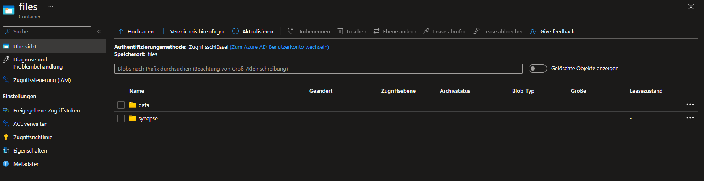
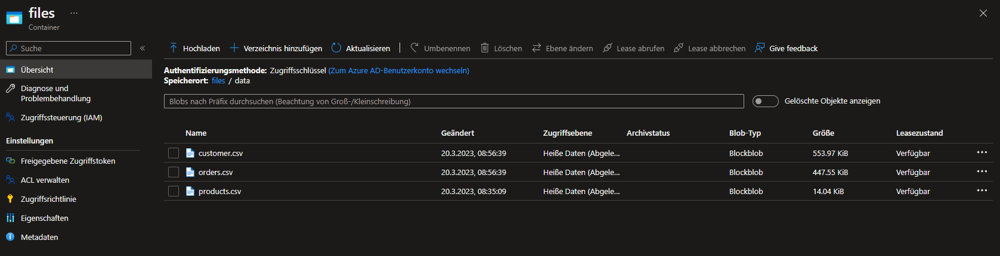
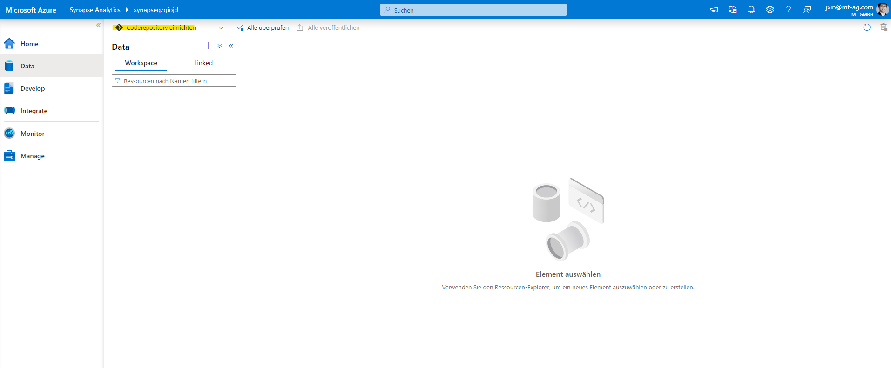
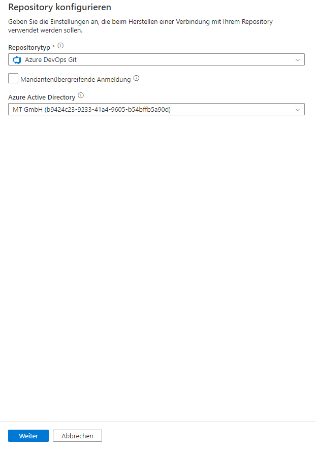
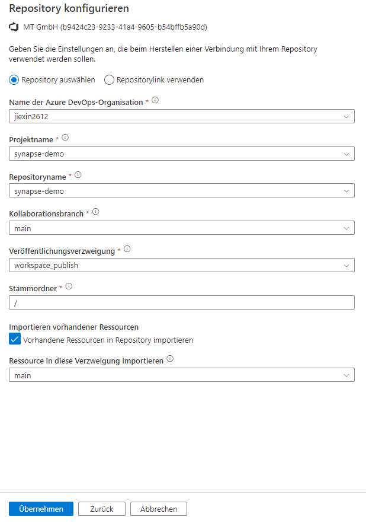
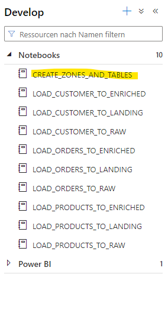
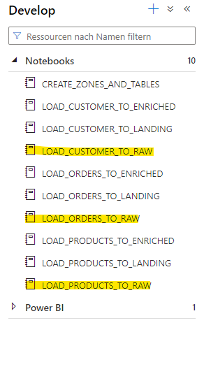
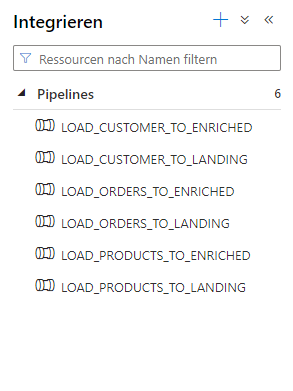

# Use Delta Lake with Spark in Azure Synapse Analytics

Delta Lake is an open source project to build a transactional data storage layer on top of a data lake. Delta Lake adds support for relational semantics for both batch and streaming data operations, and enables the creation of a *Lakehouse* architecture in which Apache Spark can be used to process and query data in tables that are based on underlying files in the data lake.

## Before you start

You'll need an [Azure subscription](https://azure.microsoft.com/free) in which you have administrative-level access.

## Provision an Azure Synapse Analytics workspace

You'll need an Azure Synapse Analytics workspace with access to data lake storage and an Apache Spark pool that you can use to query and process files in the data lake.

You can use a combination of a PowerShell script and an ARM template to provision an Azure Synapse Analytics workspace.

1. Sign into the [Azure portal](https://portal.azure.com) at `https://portal.azure.com`.
2. Use the **[\>_]** button to the right of the search bar at the top of the page to create a new Cloud Shell in the Azure portal, selecting a ***PowerShell*** environment and creating storage if prompted.

   > **Note**: If you have previously created a cloud shell that uses a *Bash* environment, use the the drop-down menu at the top left of the cloud shell pane to change it to ***PowerShell***.
3. Note that you can resize the cloud shell by dragging the separator bar at the top of the pane, or by using the **&#8212;**, **&#9723;**, and **X** icons at the top right of the pane to minimize, maximize, and close the pane. For more information about using the Azure Cloud Shell, see the [Azure Cloud Shell documentation](https://docs.microsoft.com/azure/cloud-shell/overview).

4. Microsoft offering an Tutorial for Azure Synapse Analytics using Delta Lake. In the PowerShell pane, enter the following commands to clone this repo:

    ```
    rm -r dp-203 -f
    git clone https://github.com/MicrosoftLearning/dp-203-azure-data-engineer dp-203
    ```

5. After the repo has been cloned, enter the following commands to change to the folder for this exercise and run the **setup.ps1** script it contains:

    ```
    cd dp-203/Allfiles/labs/07
    ./setup.ps1
    ```

6. If prompted, choose which subscription you want to use (this will only happen if you have access to multiple Azure subscriptions).
7. When prompted, enter a suitable password to be set for your Azure Synapse SQL pool.

   > **Note**: Be sure to remember this password!
8. Wait for the script to complete - this typically takes around 10 minutes, but in some cases may take longer. While you are waiting, review the [What is Delta Lake](https://docs.microsoft.com/azure/synapse-analytics/spark/apache-spark-what-is-delta-lake) article in the Azure Synapse Analytics documentation.

## Naming cloud storage for saving files and upload files

1. After the script has completed, in the Azure portal, go to the **dp203-*xxxxxxx*** resource group that it created, and select the datalake storage, change the name of products to data



2. Then upload customer.csv and orders.csv



## Login in to synapse studio

1. Then in the Azure portal, go to the **dp203-*xxxxxxx*** resource group that it created, and select your Synapse workspace and use Synapse Studio to open it

## Use git-function to synchronize repo-content with synapse studio

1. Select the Option **Coderepository einrichten** and type all necessary informations to check out with the git repo.



2. Select **Repositorytyp** and **Azure Active Directory**



3. Select **Oragnisation**, **Projektname**, **Repositoryname** and **Branch**



## Use CREATE_ZONES_AND_TABLES to create zones and manged delta-tables

1. Execute the script **CREATE_ZONES_AND_TABLES** 



## Use Raw-Script to process data from file to Raw-Zone

1. Execute scripts **_RAW** to load data from csv files to delta tables



## Use synapse-pipeline to process data from Raw-Zone to Enriched-Zone

1. Execute scripts different stored pipelines to process data to Enriched-Zone



## Delete Azure resources

If you've finished exploring Azure Synapse Analytics, you should delete the resources you've created to avoid unnecessary Azure costs.

1. Close the Synapse Studio browser tab and return to the Azure portal.
2. On the Azure portal, on the **Home** page, select **Resource groups**.
3. Select the **dp203-*xxxxxxx*** resource group for your Synapse Analytics workspace (not the managed resource group), and verify that it contains the Synapse workspace, storage account, and Spark pool for your workspace.
4. At the top of the **Overview** page for your resource group, select **Delete resource group**.
5. Enter the **dp203-*xxxxxxx*** resource group name to confirm you want to delete it, and select **Delete**.

   After a few minutes, your Azure Synapse workspace resource group and the managed workspace resource group associated with it will be deleted.